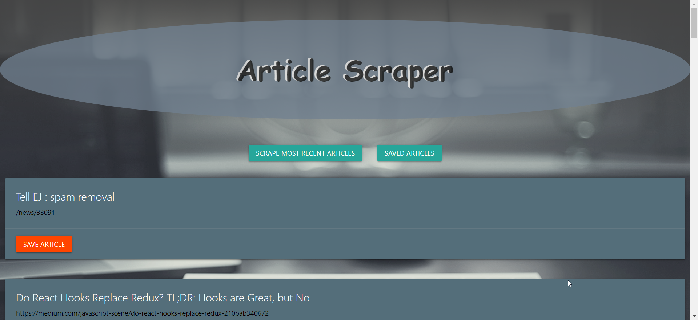

# Echo Article-Scraper

[Deployed Link](https://echo-article-scraper.herokuapp.com)

### Landing Page

### Website In Action

## Description

You can now scrape your favorite Echojs articles with the touch of a button. You can save them and add notes to reference for later. Have no more use for them?... Just simply remove them from your saved list.

### How to Use: 

Simply start by clicking the "Scrape Most Recent Articles" button and your articles will be displayed in front of you.

### System Requirements

* NodeJS
* NPM installing in terminal all required packages through 
>npm install
* Mongo DB (local) and mLab (deployed) on Heroku

# Technologies Used

* HTML
* CSS
* MaterializeCSS
* Javascript
* jQuery
* Express
* NoSQL (MongoDB / mLab MongoDB)
* Mongoose
* Handlebars

# Author

Phillip Chang
